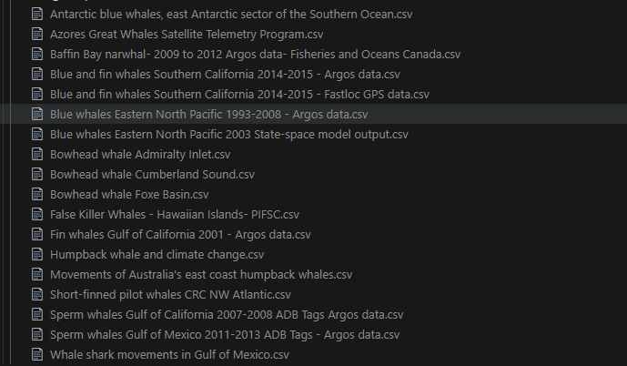

# Project Planning
Within this porject I wanted to leverage both my existing knowledge from biology and my new skills developed through [DigitalFutures](https://digitalfutures.com/) data engineering course. 

## Ideas considered: 

- An interactive app utilising location data on invasive species to track spread and extent of invasion.
- An app mapping migrations and against data of weather conditions
- An app for people interested in a specific animal for use in seeing their distribution for insight and were to see them.

## Chosen idea

A project to that uses real whale GPS data allowing insights in their distribution and movement. 

With the chosen idea a user story was developed for the overarching project. 

## ETL User Stories and Requirements

### Epic

**As a user of the whale-movement analytics platform**,  
I want a robust ETL pipeline that extracts, cleans, standardises, and enriches whale GPS from multiple Movebank studies, so that I can analyse the and display interactive visualisations in the Streamlit app.

---

### Role Definition

**As a data engineer**,  
I want to create a robust ETL pipeline that handles data effectively, showcasing data cleaning, standardisation, enrichment, and aggregation, so that I can produce a Streamlit app with interesting analysis and is visually pleasing.

---

## User Story 1: Data Selection

**As a data engineer**,  
I want to find data that is sufficiently messy and rich in information,  
so that I can demonstrate effective ETL techniques and build an interesting analytical application.**

### Acceptance Criteria
- Dataset must contain at least 10,000 rows or exceed 10 MB.  
- Dataset must comply with open-data licences and fair-use regulations.  
- Raw datasets must be stored in the `data/raw/` directory.  

### Definition of Done
- A validated dataset is selected.  
- Data is downloaded, stored in project structure, and verified to meet volume criteria.
  

### Future Work
- Incorporate **FOS/ environmental data** to enrich analysis.

---
